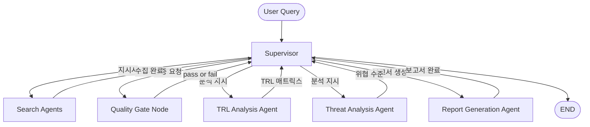

# Technology Strategy Analysis Service
멀티 에이전트 기반으로 최신 기술 신호를 수집하고, 품질 검증을 거쳐 TRL/Threat 분석과 근거 추적 가능한 전략 보고서를 생성하는 Python 프로젝트입니다.

## Overview
- Objective : HBM4, PIM, CXL, Advanced Packaging, Thermal/Power 등 반도체 전략 기술 축에 대해 최신 동향, 경쟁사 신호, 리스크를 구조화된 보고서로 정리
- Method : Supervisor가 병렬 검색, 정규화, 품질 게이트, targeted retry, 분석, 보고서 생성을 단계적으로 오케스트레이션
- Tools : Python, OpenAI API, Tavily Search API, Jina Embeddings API, SQLite, Pytest

## Features
- 6개 Search Agent 병렬 실행
- 검색 결과를 공통 evidence schema로 정규화하고 원문과 key points를 분리 저장
- Coverage, source diversity, deduplication, conflict, low-confidence 검사 수행
- 편향 완화 전략 적용
  source type 편중, 특정 기업 편중, 상충 신호, low evidence cell을 함께 탐지해 단일 출처 결론을 방지
- targeted retry 기반 재탐색
  품질 부족 셀만 다시 검색해 전체 재실행 비용을 줄임
- TRL 분석과 Threat 분석 결과를 merge하여 priority matrix 생성
- Markdown, HTML, PDF 형식의 전략 보고서 생성
- reference trace를 포함한 근거 추적형 출력 지원
- Tavily 실패 시 cache 또는 deterministic provider로 fallback

## Tech Stack

| Category | Details |
|----------|---------|
| Language | Python |
| Orchestration | CentralSupervisor, StageGate, RetryController |
| Search | Tavily Search API, Deterministic Search Provider |
| LLM | OpenAI API (`gpt-4.1-mini` 기본값), Rule-based fallback |
| Embedding | Jina Embeddings API (`jina-embeddings-v4`) |
| Retrieval | Embedding 기반 evidence similarity retrieval |
| Storage | SQLite repository, local file outputs |
| Testing | Pytest |

## Agents

- Search Agent - PIM: architecture, productization, customer collaboration 신호 탐색
- Search Agent - CXL: memory expansion, ecosystem, standard adoption 탐색
- Search Agent - HBM4: roadmap, performance, mass production timing 탐색
- Search Agent - Packaging: hybrid bonding, interposer, UCIe 탐색
- Search Agent - Thermal/Power: cooling, power delivery, thermal bottleneck 탐색
- Search Agent - Indirect Signal: patent, job posting, conference presentation 탐색
- TRL Analysis Agent: 기술 성숙도 추정
- Threat Analysis Agent: 경쟁 위협 수준 평가
- Report Generation Agent: 전략 보고서와 reference trace 생성
- Central Supervisor: stage 승인, retry, 최종 승인 결정

## Architecture



## Directory Structure

```text
agent-markdown/
├── data/
│   ├── analysis/reports/      # 생성된 Markdown/HTML/PDF 보고서
│   └── cache/tavily/          # Tavily 검색 캐시
├── scripts/                   # 작업/실행 보조 스크립트
├── src/
│   ├── agents/                # Search / Analysis Agent 구현
│   ├── app/                   # 앱 조립 및 bootstrap
│   ├── config/                # 환경변수, threshold, query 설정
│   ├── normalization/         # evidence 정규화 및 tagging
│   ├── orchestration/         # 병렬 검색, merge, stage 실행
│   ├── prompts/               # 분석 프롬프트 템플릿
│   ├── providers/             # Search / LLM / Embedding provider
│   ├── quality/               # 품질 검증 로직
│   ├── retrieval/             # embedding 기반 evidence retrieval
│   ├── schemas/               # canonical schema
│   ├── storage/repositories/  # SQLite 기반 repository
│   └── supervisor/            # planning, gate, retry, orchestration
├── tests/                     # unit / integration 테스트
├── AGENTS.md
├── architecture.md
├── directory.md
├── service-spec.md
├── workflow.md
└── README.md
```

## Getting Started

### 1. Environment Variables

`.env` 또는 shell 환경변수에 아래 값을 설정합니다.

```env
SEARCH_PROVIDER=tavily
LLM_PROVIDER=openai
EMBEDDING_PROVIDER=jina
OPENAI_API_KEY=your_openai_key
OPENAI_MODEL=gpt-4.1-mini
TAVILY_API_KEY=your_tavily_key
TAVILY_MAX_RESULTS=5
JINA_API_KEY=your_jina_key
EMBEDDING_MODEL=jina-embeddings-v4
```

API 키가 없으면 각각 deterministic search, rule-based LLM judge, noop embedding으로 fallback 됩니다.

### 2. Programmatic Usage

현재 저장소에는 별도 CLI 엔트리포인트보다 Python 레벨 사용 흐름이 먼저 구현되어 있습니다.

```python
from src.app.bootstrap import build_app

app = build_app(dotenv_path=".env")
artifacts = app.supervisor.run(
    run_id="run-demo",
    user_query="HBM4 and PIM strategic scan",
    technology_axes=["HBM4", "PIM"],
    seed_competitors=["SK hynix", "Micron"],
)

print(artifacts.report.output_path)
print(artifacts.approval.status.value)
```

### 3. Test

```bash
pytest -q
```

## Output Artifacts

- Raw/normalized evidence와 quality report는 repository 계층을 통해 저장
- 보고서는 기본적으로 `data/analysis/reports/`에 생성
- 보고서 포맷은 `markdown`, `html`, `pdf` 지원
- execution state, retry plan, approval decision은 SQLite repository에서 관리

## Current Validation Status

- `pytest -q` 기준 90개 테스트 중 87개 통과, 3개 실패
- 실패 항목
  `tests/unit/test_priority_matrix.py`
  `tests/unit/test_report_generation_agent.py` 내 PDF 출력 관련 검증
  `tests/unit/test_report_generation_agent.py` 내 blocked status 검증
- PDF 출력은 로컬 `pango-view` 또는 `cupsfilter` 가용성에 영향을 받음

## Contributors

- dylee00
- younghoon41
- 윤세준

## References

- [service-spec.md](./service-spec.md)
- [workflow.md](./workflow.md)
- [directory.md](./directory.md)
- [architecture.md](./architecture.md)
